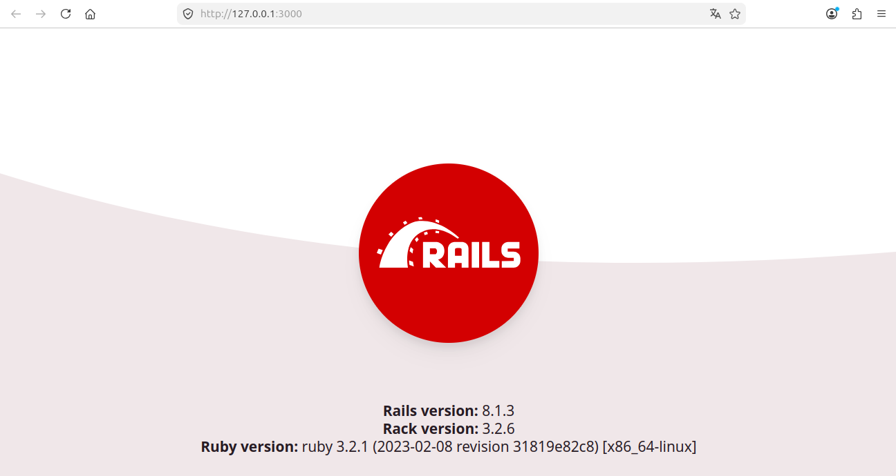
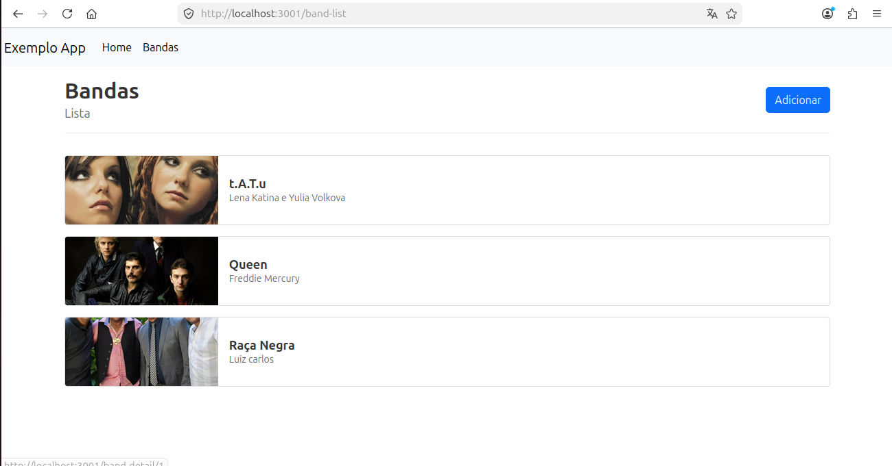

# Projeto de exemplo React on Rails
\
**Back-end: Ruby on Rails**
\
**Front-end: React**
\
**Banco de dados: PostgreSQL**
\
\
Comandos para montarmos os containers back-end:
\
**cd back-end**
\
**docker-compose build**
\
**docker-compose up**
\
\
Comandos para montarmos o container front-end (em nova aba do terminal):
\
**cd front-end**
\
**docker build -t frontendapp .**
\
**docker run -p 8080:3000 frontendapp**
\
\
Imagem abaixo é a aplicação back-end sendo executada:
\
\

\
\
Imagem abaixo é a aplicação front-end sendo executada:
\
\

